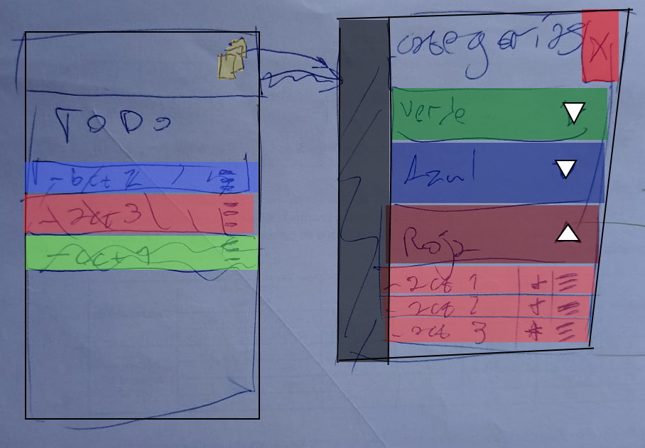

# Reto Quehaceres Categorizados
*Disclaimer: No está planeado que haya más que este reto.*

## Introducción

Me surgió una idea para una aplicación simple y pensé "¿Cómo la haría otra gente?", y cuando le comentaba a un amigo se me ocurrió que invitar a más gente para ver todas las diferencias podría ser algo **interesante**, **divertido** y quizás, **enriquecedor**.

Eso es todo. Ese es el origen de esto.

## Dinámica

Vamos a la carne de esto.

A partir de cuando lean esto, ya pueden arrancar.

[Más abajo](#aplicación) está toda la info que tienen que saber. Lo que no esté explícito o las dudas que les surjan las resuelven o les inventan soluciones uds. Si me preguntan algo les voy a decir:

- "Como quieras."
- "No sé."
- "Pensalo."
- "Capaz."

Y así.

**Importante:**

> Si bien yo lo llamo aplicación, la realidad es que pueden hacer cualquier tipo de programa. Desde una aplicación de consola hasta un sitio web, pasando por un empaquetado para escritorio o un simple script. **Todo vale.**

Antes de empezar a diseñar y programar deberían **fork**ear este proyecto y crear una nueva carpeta con su apodo, seudónimo o nombre. Ahí va a quedar su proyecto terminado.

Si bien estaría copado que desarrollen el proyecto en Git para poder ver su evolución, pueden desarrollarlo aparte y meter la versión final en la carpeta, ala *drag and drop*. Como les sea más cómodo.

Por ejemplo, mi fork se vería así:
```
📦reto-quehaceres-categorizados
 ┣ 📂c3r38r170
 ┃ ┗ 📜README.md
 ┣ 📜garabato.jpg
 ┗ 📜README.md
```

Con los archivos de mi aplicación también en *mi* carpeta, claro.

Una vez subido el proyecto terminado, hacen una *pull request*, y si quieren, me avisan. Yo el último día voy a aceptar todas las *pull request* así que tienen hasta entonces para editarlo, cambiarlo, lo que quieran.

Algunas pautas:
- Obviamente el proyecto debe tener lo que dice la sección de [Aplicación](#aplicación).
- **Fecha límite:** 17/02/2022 19:00hs
- **NO** editar los archivos existentes ni hacer nada fuera de su carpeta. No les acepto las *PR*.
- **NO** hacer ningún cambio a este repositorio. Ojalá pudiera directamente evitarlo pero en GitHub no es posible. Los cambios serán deshechos y serán eliminados como colaboradores.
- Incluyan un *README* en sus proyectos explicándolo y preferentemente mostrándolo con imágenes. Sería bonito si lo ponen ganas.
- Traten de **no** comunicarse entre uds., estaría bueno que las producciones sean *personales* y *originales*.

Algunas libertades:
- Puede/n usar la/s tecnología/s que quiera/n.
- Pueden agregar más cosas si les parece que entran en el alcance de la aplicación.

## Aplicación

El concepto es muy simple: Una lista de quehaceres (TO-DO) donde los items puedan ser de diferentes categorías.

El dibujo que hice cuando se me ocurrió esto, con algunos detalles que imaginé en el momento es el siguiente:



Esto es un garabato de la primer idea que tuve. Es solo (**SOLO**) para que se entienda la idea.

No deberían tener en cuenta esto para el diseño en absoluto, solo deberían entender el concepto.

**Nótese** que yo estoy dele decir "aplicación" y el dibujo parece la pantalla de un celular. Esto **NO** significa que la aplicación tenga que ser una aplicación móvil. Puede ser cualquier tipo de aplicación, como aclaré más arriba.

Como se puede ver, hay:
- Items que pertenecen a categorías (serían como las "acciones" o "*actividades*")
- Categorías que tienen items (un pequeño detalle es que los nombres de las categorías serían arbitrarios, no los colores)
- Un listado:
  - **común** (pueden ir items de distintas categorías mezclados)
  - y **ordenado**. (el orden importa, no es arbitrario)

Eso es todo lo "obligatorio" que tiene que tener la aplicación. El resto, *a gusto y piacere*.

***Happy coding!***

## FAQ

*Esta sección se irá llenando a medida que se presenten dudas comunes que tenga sentido responder y recolectar aquí.*

### ¿Va a haber algo así de vuelta más adelante?
Quizás, pero [no cuentes con ello](https://c.tenor.com/FLV7sGtaM9oAAAAC/toy-story-woody.gif). Y si llega a suceder, será en [GitLab](https://gitlab.com).

### Encontré un error en / Tengo una sugerencia para este *README*, ¿lo cambio?
No. Me avisan y lo hago yo. E' mío.